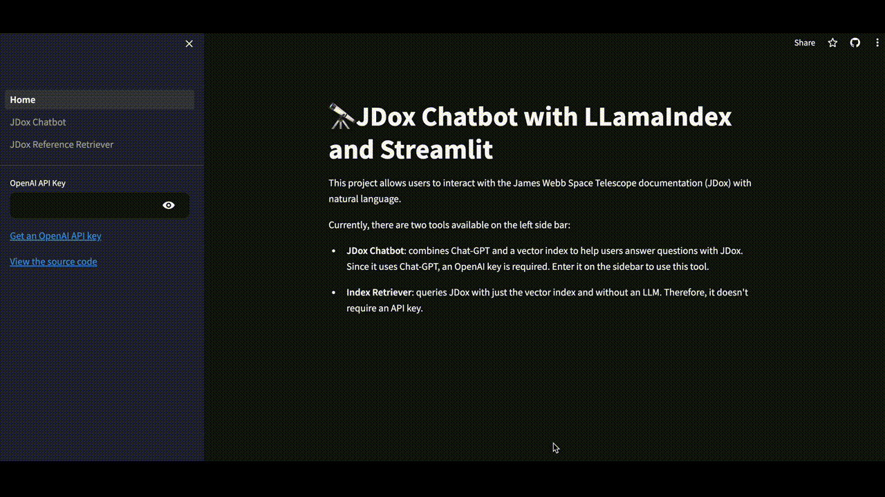

# JDox Chatbot 

Visit the app at [https://jdoxbot.streamlit.app/](https://jdoxbot.streamlit.app/)!

The app uses llama-index to build a chatbot that incorporates context from the JWST docs. The context is retrieved from a vector index of embedded documents scraped from https://jwst-docs.stsci.edu/.

Here is a preview of it in action. 

## Build Index

Run `python generate.py`

## Launch App

Run locally with `streamlit run Home.py`

## Get an OpenAI API key

You can get your own OpenAI API key by following the following instructions:
1. Go to https://platform.openai.com/account/api-keys.
2. Click on the `+ Create new secret key` button.
3. Next, enter an identifier name (optional) and click on the `Create secret key` button.

## Try out the app

Once the app is loaded, enter your question about the Streamlit library and wait for a response.
